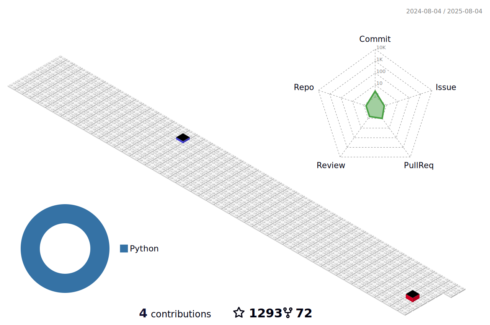

<div align="center">
<h1>🎉 Welcome to my profile 👋 欢迎来到我的主页 💖</h1>
  You're the
  
  th person to visit my profile.
</div>

<br>

<div align="center">
  <a href="https://git.io/typing-svg"></a>
</div>

<div align="center">
  <picture>
    <source media="(prefers-color-scheme: dark)" srcset="./contribution-grid-snake/snake-dark.svg" />
    <source media="(prefers-color-scheme: light)" srcset="./contribution-grid-snake/snake.svg" />
    
  </picture>
</div>

<br>

<div align="center">
  
</div>

<br>

<div align="center">
  
  
</div>

<br>

```javascript
const zeal = {
    pronouns: "He" | "Him",
    askMeAbout: ["Tech", "Game"],
    technologies: {
        frontEnd: {
            language: ["CSS", "HTML", "Javascript"],
            framework: ["Vue", "React", "Bootstrap", "Pyside6", "PyQt6"]
        },
        backEnd: {
            language: ["C", "C++", "C#", "Python", "Java", "Rust"],
            framework: ["Flask", "Spring Boot"]
        },
        databases: ["MySQL", "SQLite", "PostgreSQL"]
    }
};
```

- 🔭 I’m currently working on [BiliBili-Manga-Downloader](https://github.com/Zeal-L/BiliBili-Manga-Downloader)
- 🌱 I’m currently learning Python, Rust, C++
- 👯 I’m looking to collaborate on Game Project
- 🤔 I’m looking for help with GUI Design
- 💬 Ask me about My Favorite game
- 📫 How to reach me: QQ 982210694
- 😄 Pronouns: 咲夜


